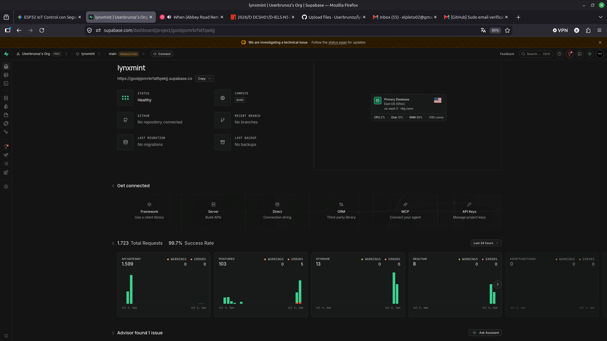
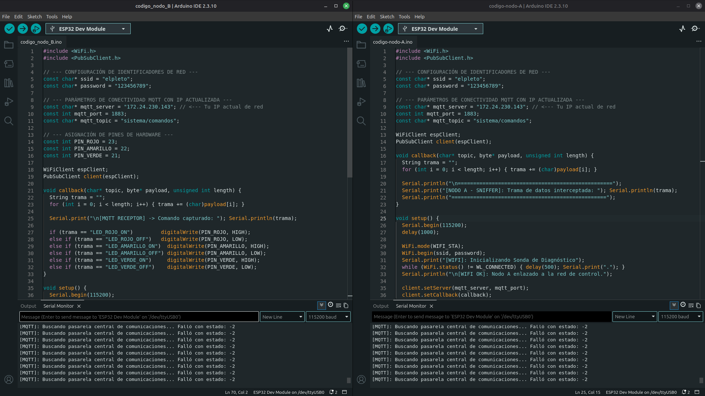
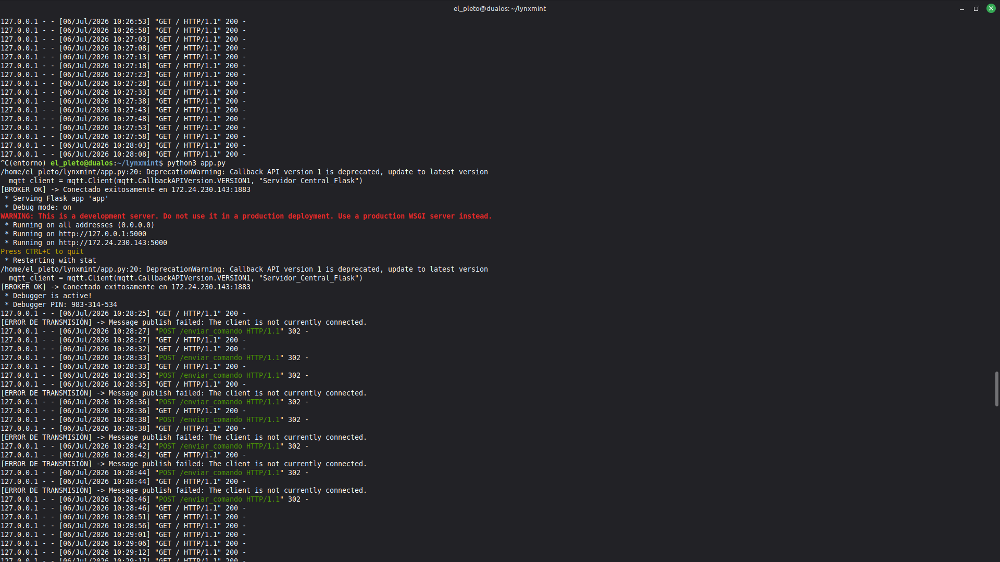

# Sistema IoT de Monitoreo Centralizado y Actuación Real Distribuida (lynxmint)
---
**Integrantes:**
* Benjamín Urrutia
* Bruno Vega

## 1. Descripción del Sistema
Este proyecto implementa una arquitectura IoT completa para el control y supervisión síncrona de variables de estado de hardware. A través de una interfaz web centralizada (desarrollada en Python/Flask y maquetada con CSS nativo, cumpliendo con la restricción estricta de NO utilizar JavaScript), el usuario emite comandos de activación hacia un Broker MQTT local (Mosquitto). Los microcontroladores actúan como clientes de red distribuidos, ejecutando y auditando las acciones sobre hardware real en tiempo real.

## 2. Justificación de Roles de las Tarjetas (ESP32)
Para garantizar la máxima estabilidad del sistema y mitigar fallas de concurrencia, se distribuyeron las tareas en dos nodos independientes bajo una topología estrella:
* **Nodo B (Actuador Principal):** Configurado en modo Estación (WIFI_STA), se suscribe de forma síncrona al tópico de control. Su rol exclusivo es la conmutación física de estados lógicos en los registros GPIO, controlando una etapa de actuación compuesta por 3 indicadores LED (Rojo, Amarillo y Verde).
* **Nodo A (Sonda de Red / Monitor Espejo):** Funciona en paralelo como un sniffer de red por hardware. Intercepta de forma independiente las tramas de datos del Broker para auditar la integridad de la telemetría, proporcionando una línea de diagnóstico separada del servidor web.

## 3. Persistencia de Datos
Cada comando ejecutado desde la interfaz web genera un log asíncrono con estampa de tiempo precisa (Año-Mes-Día Hora:Minuto:Segundo) que es enviado inmediatamente a una base de datos relacional en la nube a través de **Supabase**, cumpliendo con los requerimientos de auditoría y almacenamiento históricos exigidos.

## 4. Evidencias de Funcionamiento
El registro visual del circuito operando en paralelo con la interfaz web, la base de datos Supabase y la terminal de control se encuentra debidamente respaldado en el repositorio:

* **Persistencia de Datos en Nube (Supabase Dashboard):**
  

* **Interfaz de Control Web (Abyssal Void):**
  

* **Validación de Código y Sockets en Terminal:**
  

* **Estructura Interna de Control:**
  

* [Explorar carpeta completa de evidencias](./capturas/)
